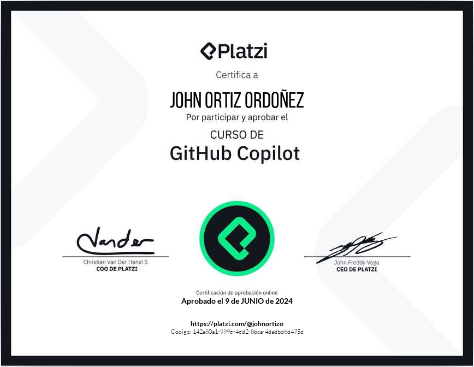
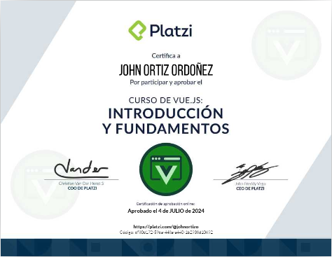
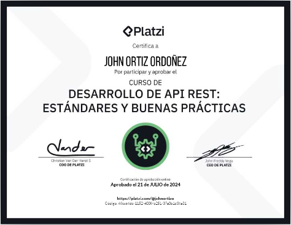

# Repositorio de Cursos de Platzi

Bienvenido a mi repositorio de cursos de Platzi. Aquí encontrarás todos los proyectos y ejercicios que estoy realizando en los cursos de la plataforma de eLearning Platzi.

## Comienzo del Viaje de Aprendizaje

Comencé mi viaje de aprendizaje en Platzi el 6 de junio de 2024. Estoy emocionado por todo lo que aprenderé y compartiré en este repositorio.

## GitHub Copilot [CURSO]

Este es el curso de GitHub Copilot que estoy realizando en Platzi. En este curso aprenderé a utilizar GitHub Copilot, una herramienta de inteligencia artificial que ayuda a escribir código.

Carpeta: `GitHub-Copilot-Curso`.
Fecha de terminación: 10 de junio de 2024
URL: [GitHub Copilot](https://platzi.com/cursos/github-copilot/)

## Vue.js: Introducción y Fundamentos [CURSO]

Este es el curso de Vue.js: Introducción y Fundamentos que estoy realizando en Platzi. En este curso aprenderé a utilizar Vue.js, un framework de JavaScript para construir interfaces de usuario.

Carpeta: `VueJS-Intro-Fundamentos`.
URL: [Vue.js: Introducción y Fundamentos](https://platzi.com/cursos/vuejs/)
Fecha de terminación: 4 de julio de 2024

## Desarrollo de API REST: Estándares y Buenas Prácticas [CURSO]

Este es el curso de Desarrollo de API REST: Estándares y Buenas Prácticas que realicé en Platzi. En este curso aprendí a desarrollar APIs RESTful siguiendo estándares y buenas prácticas.

Carpeta: `Desarrollo-API-REST`.
Fecha de terminación: 21 de julio de 2024
URL: [Curso de Desarrollo de API REST: Estándares y Buenas Prácticas](https://platzi.com/cursos/buenas-practicas-api/)

## Contacto

Si tienes alguna pregunta o comentario sobre mi trabajo, no dudes en contactarme.

¡Gracias por visitar mi repositorio!